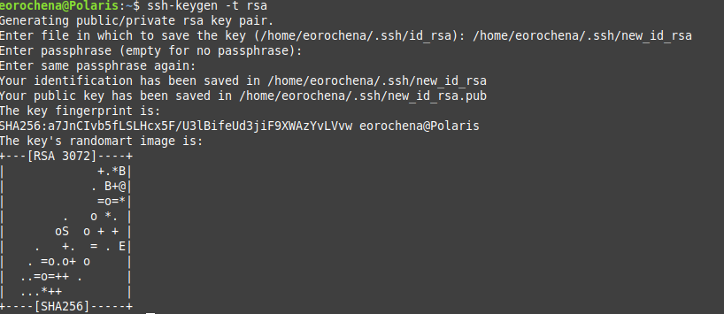

To create an SSH key pair run the following command 

> $ ssh-keygen -t rsa

After you run that command you will be presented with a few prompts

> Enter file in which to save the key (/home/eorochena/.ssh/id_rsa): /home/eorochena/.ssh/new_id_rsa <<< you can leave it blank if you don't have an SSH key pair, or if you don't want to overwrite your existing one.
> Enter passphrase (empty for no passphrase):  <<< Enter a passphrase for additional security, remember security is always a good thing. :smile: 
> Enter same passphrase again:  <<< re-enter passphrase.
> Your identification has been saved in /home/eorochena/.ssh/new_id_rsa  <<< New private key location.
> Your public key has been saved in /home/eorochena/.ssh/new_id_rsa.pub  <<< New public key location.

